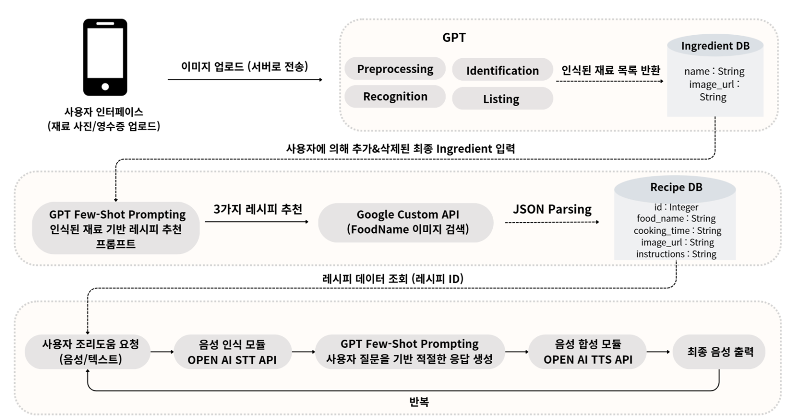

# 🥗 2024-2-DSCD-FLOW-4

> **Multi-modal LLM 기반 조리 도우미 서비스 : Voice를 곁들인 방구석 미슐랭**

본 서비스는 Multimodal(이미지 및 음성 기반) & Interactive(상호작용형) AI 조리 어플리케이션으로, MZ 세대를 위한 집밥 조리의 편의성을 높이며 요리 진입 장벽을 낮추는 것을 목표로 합니다. 재료 인식, 레시피 추천, 조리 과정 안내까지 한 번에 해결하는 All-in-One Solution을 통해, 사용자가 요리 과정에서 겪는 불편함을 해소하고 실시간 문제 해결을 지원합니다.

---

## 👥 팀 구성

| **구분** | **이름**   | **학번**     | **소속 학과**          | **이메일**                 |
|----------|------------|--------------|------------------------|----------------------------|
| 팀장     | 황재연     | 2019112487   | 산업시스템공학과       | khanman000409@gmail.com    |
| 팀원     | 김동호     | 2019111437   | 경영학과               | dhjrzzang@gmail.com        |
| 팀원     | 김유선     | 2020112473   | 산업시스템공학과       | yusun0916@naver.com        |
| 팀원     | 안수아     | 2020112469   | 산업시스템공학과       | sua6545@naver.com          |

---

## 🌟 주요 기능

- **이미지 기반 재료 인식**: 사용자가 업로드한 재료 이미지를 분석하여 보유 재료를 자동으로 인식.
- **개인화된 요리 레시피 추천**: 인식된 재료를 바탕으로 사용자 맞춤형 요리 레시피 제공.
- **음성 기반 요리 과정 지원**: 음성을 통해 요리 과정 중 발생하는 문제를 실시간으로 해결하며 사용자 편의성 극대화.

---

## 🌟 기대 효과

### 📌 개인적인 측면
- 이미지를 활용한 입력 방식으로 번거로운 검색 없이 필요한 레시피를 쉽게 찾을 수 있음.
- 요리에 익숙하지 않은 사용자도 다양한 요리를 시도할 기회를 제공.
- 음성 보조 기능으로 요리 과정을 보다 직관적으로 접근 가능.

### 📌 경제적 측면
- 보유한 식재료를 촬영해 맞춤형 레시피를 추천받아 불필요한 외식이나 재료 구매를 줄일 수 있음.
- 1인 가구는 남은 식재료를 효과적으로 활용해 음식물 쓰레기를 줄이고 식비 절감 가능.

### 📌 사회적 측면
- 텍스트 입력이 어려운 사용자 및 고령층도 Multi-modal 기술로 쉽게 접근 가능.
- AI 기반 레시피 추천으로 남은 재료 활용을 돕고 음식물 쓰레기 감소를 통해 환경 보호 및 지속 가능한 소비 문화 촉진.

---

## 📂 시스템 아키텍처

  

---

## 💻 Technology Stack (기술 스택)

  
  
  
  
  

  
  
  
  

  
  
  
  

---